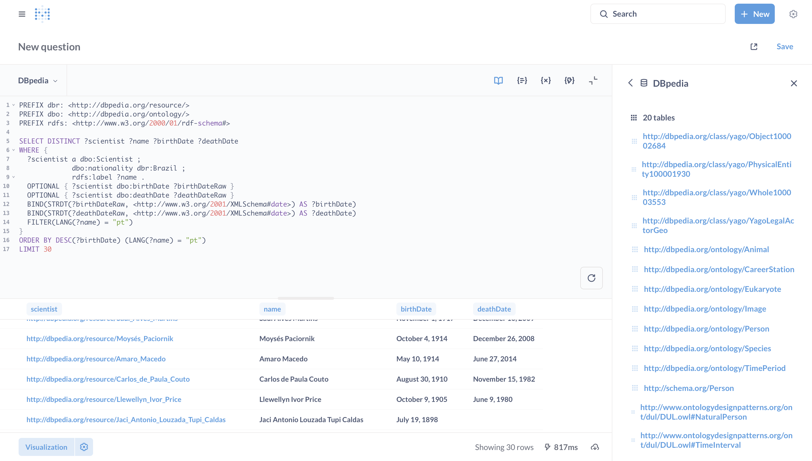
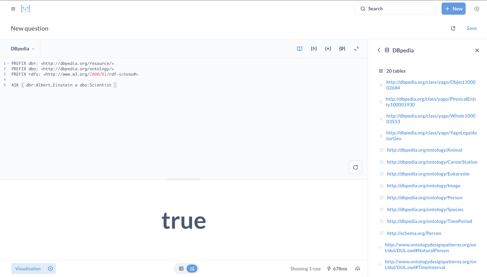

# Metabase SPARQL Driver

[](https://www.gnu.org/licenses/agpl-3.0)

A driver for connecting Metabase to SPARQL endpoints for querying RDF data.

## :mag: Overview

This driver enables Metabase to connect to SPARQL endpoints using HTTP requests to query RDF data. It supports both secure and insecure connections with optional default graph specification.

This driver follow the [SPARQL 1.1 Query Results JSON Format](https://www.w3.org/TR/2013/REC-sparql11-results-json-20130321/) specification.

## :zap: Quick Start

1. **Download** the latest driver from [releases page](https://github.com/jhisse/metabase-sparql-driver/releases)
2. **Copy** `sparql.metabase-driver.jar` to your Metabase `plugins/` directory
3. **Restart** Metabase
4. **Add database** → Select "SPARQL" → Enter endpoint URL

### :bulb: Try with DBpedia

- Endpoint URL: `https://dbpedia.org/sparql`
- Default Graph: `http://dbpedia.org`


#### Select Query Example

```sparql
PREFIX dbr: <http://dbpedia.org/resource/>
PREFIX dbo: <http://dbpedia.org/ontology/>
PREFIX rdfs: <http://www.w3.org/2000/01/rdf-schema#>

SELECT DISTINCT ?scientist ?name ?birthDate ?deathDate 
WHERE {
  ?scientist a dbo:Scientist ;
             dbo:nationality dbr:Brazil ;
             rdfs:label ?name .
  OPTIONAL { ?scientist dbo:birthDate ?birthDateRaw }
  OPTIONAL { ?scientist dbo:deathDate ?deathDateRaw }
  BIND(STRDT(?birthDateRaw, <http://www.w3.org/2001/XMLSchema#date>) AS ?birthDate)
  BIND(STRDT(?deathDateRaw, <http://www.w3.org/2001/XMLSchema#date>) AS ?deathDate)
  FILTER(LANG(?name) = "pt")
}
ORDER BY DESC(?birthDate) (LANG(?name) = "pt")
LIMIT 30
```



#### Ask Query Example

```sparql
PREFIX dbr: <http://dbpedia.org/resource/>
PREFIX dbo: <http://dbpedia.org/ontology/>
PREFIX rdfs: <http://www.w3.org/2000/01/rdf-schema#>

ASK { dbr:Albert_Einstein a dbo:Scientist }
```



## :wrench: Configuration

| Field         | Required | Description             | Example                       |
|:--------------|:--------:|:------------------------|:------------------------------|
| Endpoint URL  |   ✅     | SPARQL endpoint URL     | `https://dbpedia.org/sparql`  |
| Default Graph |   ❌     | Default graph URI       | `http://dbpedia.org`          |
| Ignore SSL    |   ❌     | Skip SSL validation     | `false`                       |

## :building_construction: Build Locally From Source

### Prerequisites

- Git
- Clojure CLI tools
- Java Development Kit (JDK) 21

Run `make check-deps` to check if dependencies are installed.

### Building the Driver JAR

1. Clone this repository:

   ```bash
   git clone https://github.com/jhisse/metabase-sparql-driver.git
   cd metabase-sparql-driver
   ```

2. Initialize the Metabase submodule:

   ```bash
   make init-metabase
   ```

3. Build the driver:

   ```bash
   make build
   ```

4. The compiled driver will be available at:

   ```text
   target/sparql.metabase-driver.jar
   ```

## :whale: Build Only Driver with Docker

```bash
make docker-build-driver
```

## :whale: Build Metabase + Driver Docker Image

```bash
make docker-build
```

## :gear: Additional Make Commands

- `make build`: Build the SPARQL driver
- `make build-full`: Complete build with checks and initialization
- `make clean`: Remove build files
- `make init-metabase`: Initialize the Metabase submodule
- `make check-deps`: Check if dependencies are installed
- `make lint`: Lint code using clj-kondo
- `make format`: Format code using cljfmt
- `make splint`: Run splint static code analysis
- `make test`: Run tests
- `make coverage`: Run tests with coverage analysis
- `make docker-build`: Build docker image
- `make docker-run`: Run docker image
- `make docker-stop`: Stop docker image
- `make docker-clean`: Clean old container
- `make docker-build-driver`: Build driver with docker
- `make help`: Display this help

## Run with debug logs

To troubleshoot connection or query issues, run Metabase with debug logging:

```bash
java --add-opens java.base/java.nio=ALL-UNNAMED -Dlog4j.configurationFile=file:./log4j2.xml -jar metabase.jar
```

**Requirements:**
- Java 21 installed
- Place `metabase.jar` in the project root folder
- The `log4j2.xml` file is already configured for SPARQL driver debugging

**What you'll see:**
- SPARQL query execution details
- Connection attempts and errors
- Data type conversion processes
- Metadata sync operations

## :handshake: Contributing

Found a bug or want to contribute? Open an issue or submit a PR!

## :page_facing_up: License

This driver is licensed under the AGPLv3 license. See the [LICENSE](LICENSE) file for details.
