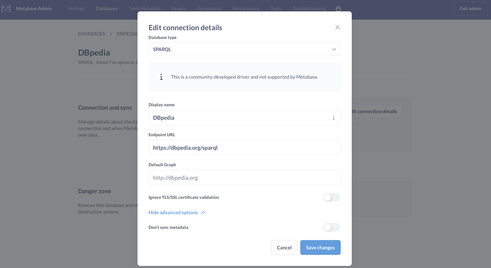

# Metabase SPARQL Driver

[](https://www.gnu.org/licenses/agpl-3.0)

A driver for connecting Metabase to SPARQL endpoints for querying RDF data.

## :mag: Overview

This driver enables Metabase to connect to SPARQL endpoints using HTTP requests to query RDF data. It supports both secure and insecure connections with optional default graph specification.

This driver follow the [SPARQL 1.1 Query Results JSON Format](https://www.w3.org/TR/2013/REC-sparql11-results-json-20130321/) specification.

## :zap: Quick Start

1. **Download** the latest driver from [releases page](https://github.com/jhisse/metabase-sparql-driver/releases)
2. **Copy** `sparql.metabase-driver.jar` to your Metabase `plugins/` directory
3. **Restart** Metabase
4. **Add database** → Select "SPARQL" → Enter endpoint URL

### :bulb: Try with DBpedia

- Endpoint URL: `https://dbpedia.org/sparql`
- Default Graph: `http://dbpedia.org`
- Query:

    ```sparql
    SELECT ?city ?population WHERE { ?city a dbo:City ; dbo:populationTotal ?population } LIMIT 10
    ```



## :wrench: Configuration

| Field         | Required | Description             | Example                       |
|:--------------|:--------:|:------------------------|:------------------------------|
| Endpoint URL  |   ✅     | SPARQL endpoint URL     | `https://dbpedia.org/sparql`  |
| Default Graph |   ❌     | Default graph URI       | `http://dbpedia.org`          |
| Ignore SSL    |   ❌     | Skip SSL validation     | `false`                       |

## :building_construction: Build From Source

### Prerequisites

- Git
- Clojure CLI tools
- Java Development Kit (JDK) 21

Run `make check-deps` to check if dependencies are installed.

### Building the Driver JAR

1. Clone this repository:

   ```bash
   git clone https://github.com/jhisse/metabase-sparql-driver.git
   cd metabase-sparql-driver
   ```

2. Initialize the Metabase submodule:

   ```bash
   make init-metabase
   ```

3. Build the driver:

   ```bash
   make build
   ```

4. The compiled driver will be available at:

   ```text
   target/sparql.metabase-driver.jar
   ```

### :gear: Additional Make Commands

- `make clean` - Remove build files
- `make check-deps` - Check if dependencies are installed
- `make build-full` - Complete build with checks and initialization
- `make help` - Display help information

## :handshake: Contributing

Found a bug or want to contribute? Open an issue or submit a PR!

## :page_facing_up: License

This driver is licensed under the AGPLv3 license. See the [LICENSE](LICENSE) file for details.
