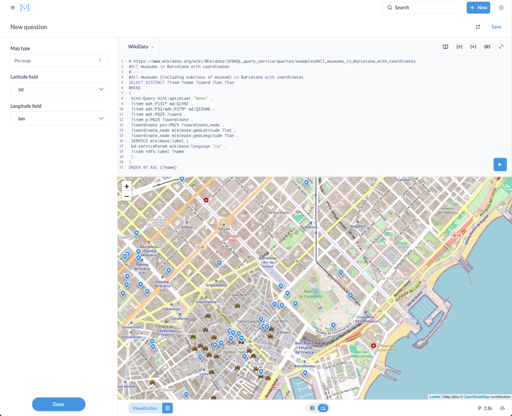
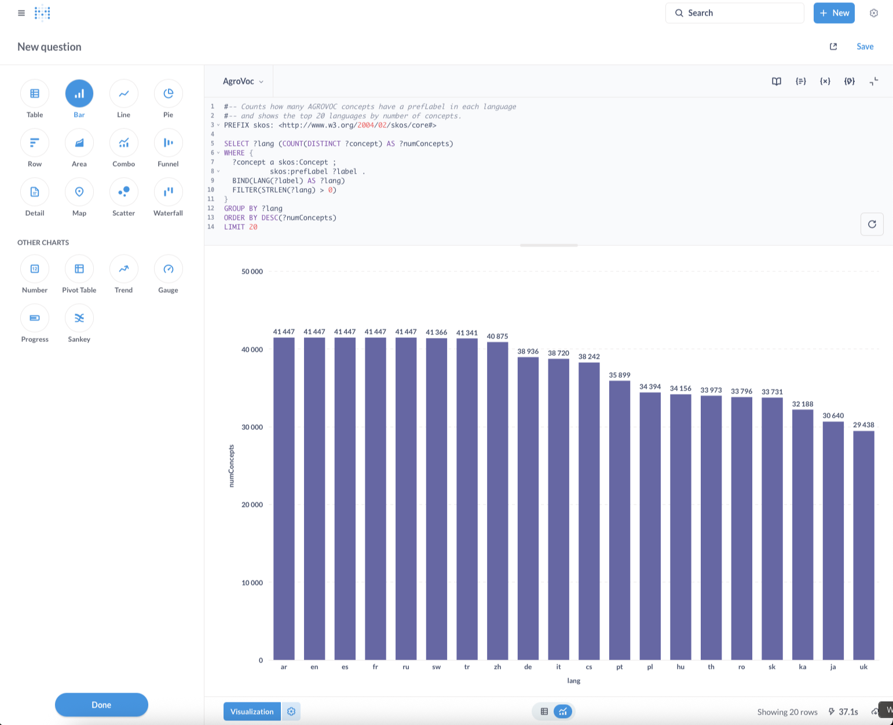

# Metabase SPARQL Driver


A driver for connecting Metabase to SPARQL endpoints for querying RDF data.

## :mag: Overview

This driver enables Metabase to connect to SPARQL endpoints using HTTP requests to query RDF data. It supports both secure and insecure connections with optional default graph specification.

This driver represents RDF classes as tables and properties as columns, allowing you to use Metabase's visual query builder to create SPARQL queries intuitively. Discovering the most frequent classes and properties can be computationally expensive on large datasets. You can disable this metadata synchronization feature in the driver's advanced configuration settings.

> [!TIP]
> If this repository is useful to you, please consider starring it ⭐.

## :handshake: Compatibility

| Driver Version       | Metabase Version | Notes                                                                                                                                          |
|:---------------------|:-----------------|:-----------------------------------------------------------------------------------------------------------------------------------------------|
| **v0.0.11+**         | v0.57.x+         | Adapts to the post-0.56 driver-API changes (pMBQL `mbql->native`, seq-based `humanize-connection-error-message`, plugin-manifest form fields). |
| **v0.0.10**          | v0.56.3 — v0.56.x | Requires `describe-database*` (added in 0.56.3).                                                                                              |
| **v0.0.1 – v0.0.9**  | < v0.56.3        | Uses legacy `describe-database`.                                                                                                               |

> [!IMPORTANT]
> Upgrading from `v0.0.10` or earlier renames the synthetic primary-key column from `id` to `subject` and shortens class/property names whose URI starts with the **Default Graph** URI. After dropping the new jar in, **re-sync each database** so the renamed metadata lands cleanly.

## :zap: Quick Start

1. **Download** the latest driver from [releases page](https://github.com/jhisse/metabase-sparql-driver/releases)
2. **Copy** `sparql.metabase-driver.jar` to your Metabase `plugins/` directory
3. **Restart** Metabase
4. **Add database** → Select "SPARQL" → Enter endpoint URL

### :bulb: Try with DBpedia

- Endpoint URL: `https://dbpedia.org/sparql`
- Default Graph: `http://dbpedia.org`


#### Select Query Example

```sparql
PREFIX dbr: <http://dbpedia.org/resource/>
PREFIX dbo: <http://dbpedia.org/ontology/>
PREFIX rdfs: <http://www.w3.org/2000/01/rdf-schema#>

SELECT DISTINCT ?scientist ?name ?birthDate ?deathDate
WHERE {
  ?scientist a dbo:Scientist ;
             dbo:nationality dbr:Brazil ;
             rdfs:label ?name .
  OPTIONAL { ?scientist dbo:birthDate ?birthDateRaw }
  OPTIONAL { ?scientist dbo:deathDate ?deathDateRaw }
  BIND(STRDT(?birthDateRaw, <http://www.w3.org/2001/XMLSchema#date>) AS ?birthDate)
  BIND(STRDT(?deathDateRaw, <http://www.w3.org/2001/XMLSchema#date>) AS ?deathDate)
  FILTER(LANG(?name) = "pt")
}
ORDER BY DESC(?birthDate) (LANG(?name) = "pt")
LIMIT 30
```


#### Ask Query Example

```sparql
PREFIX dbr: <http://dbpedia.org/resource/>
PREFIX dbo: <http://dbpedia.org/ontology/>
PREFIX rdfs: <http://www.w3.org/2000/01/rdf-schema#>

ASK { dbr:Albert_Einstein a dbo:Scientist }
```


## :camera: Screenshots






## :arrows_counterclockwise: Automatic Type Conversion

The driver automatically converts XSD / RDF datatypes to Metabase types. At **query time** (result rows) the mapping is sample-based and applies to every sync strategy; at **sync time** (SHACL strategy) the same mapping is applied directly from `sh:datatype`.

| XSD / RDF Datatype                                                 | Metabase Base Type | Notes                                                                |
|:-------------------------------------------------------------------|:-------------------|:---------------------------------------------------------------------|
| `xsd:integer`, `xsd:int`, `xsd:long`, `xsd:short`, `xsd:byte`      | Integer            | `42`, `-100`                                                          |
| `xsd:nonNegativeInteger`, `xsd:positiveInteger`, `xsd:unsigned*`   | Integer            | `0`, `1`, `255`                                                       |
| `xsd:decimal`, `xsd:float`, `xsd:double`                           | Float              | `3.14`, `2.718`                                                       |
| `xsd:boolean`                                                      | Boolean            | `true`, `false`                                                       |
| `xsd:dateTime`, `xsd:dateTimeStamp`, `xsd:gYear`, `xsd:gYearMonth` | DateTime / DateTimeWithTZ | `2024-01-15T10:30:00Z`                                          |
| `xsd:date`, `xsd:gMonthDay`, `xsd:gDay`, `xsd:gMonth`              | Date               | `2024-01-15`                                                          |
| `xsd:time`                                                         | Time               | `10:30:00`                                                            |
| `xsd:anyURI`                                                       | Text (semantic `type/URL`) | Stored as text but rendered as a URL                          |
| `rdf:langString` *(SHACL only)*                                    | Text (`database-type: langString`) | Triggers per-column `FILTER(LANG(?x) = "<lang>")` when **Default Language** is set |
| URIs (subject column)                                              | URL                | `http://dbpedia.org/resource/Berlin`                                  |
| Untagged literals                                                  | Text               | `"Hello"`                                                             |
| Language-tagged literals not declared as `rdf:langString`          | Text               | `"Hello"@en` — value comes through, the language tag is stripped by SPARQL `STR()` when needed |

## :wrench: Configuration

| Field                                 | Required | Description                                                                                                                                                                                                                                              | Example/Options                     |
|:--------------------------------------|:--------:|:---------------------------------------------------------------------------------------------------------------------------------------------------------------------------------------------------------------------------------------------------------|:------------------------------------|
| SPARQL Endpoint                       |    ✅    | SPARQL endpoint URL.                                                                                                                                                                                                                                     | `https://dbpedia.org/sparql`        |
| Ignore SSL Certificate Errors         |    ❌    | Skip TLS/SSL validation.                                                                                                                                                                                                                                 | `false`                             |
| Default Graph URI                     |    ❌    | Default graph URI **and** implicit base prefix. RDF classes and properties whose URI starts with this value are shortened in the Metabase UI — `https://odis.q.libis.be/Archief` becomes `Archief`. The full URI is reconstructed automatically at query time. | `https://odis.q.libis.be/`          |
| Default Language                      |    ❌    | BCP-47 language tag. When set, queries against `rdf:langString` columns are filtered to this language (untagged literals are still kept), and SHACL `sh:name` / `sh:description` literals are picked using this language first.                          | `nl`, `en`                          |
| Hide URIs outside the Default Graph   |    ❌    | When enabled, RDF classes and properties whose URI does **not** start with the Default Graph URI are skipped during sync (less clutter when external vocabularies are sampled).                                                                          | `false`                             |
| Metadata Sync Strategy (Advanced)     |    ❌    | How the driver discovers tables/fields.                                                                                                                                                                                                                  | `auto` / `none` / `explicit` / `shacl` |
| Schema Configuration (Advanced)       |    ❌    | JSON schema. Visible when strategy is `explicit`.                                                                                                                                                                                                        | See JSON example below              |
| SHACL URL (Advanced)                  |    ❌    | URL serving a SHACL document in Turtle. Visible when strategy is `shacl`. Fetched on every sync.                                                                                                                                                         | `https://example.org/schema.ttl`    |

**Metadata Sync Strategy options:**

- **`auto`** (default): Sample the endpoint with SPARQL queries to discover classes and properties.
  - **Class Discovery Limit**: Maximum number of RDF classes (tables) to discover (default: 100)
  - **Property Discovery Limit**: Maximum number of properties (fields) per class (default: 20)
  - **Discovery Sample Size**: Number of instances to sample when discovering properties (default: 10000)
- **`none`**: Skip metadata sync entirely (useful for very large datasets where discovery is slow).
- **`explicit`**: Use a manually defined JSON schema (see example below).
- **`shacl`**: Fetch a SHACL document and treat it as the schema. See [SHACL Schema Sync](#shacl-schema-sync) below — this is the recommended path when you control the ontology.

### Default Graph URI as Implicit Base Prefix

The **Default Graph URI** doubles as the implicit base prefix for the database. When it is set, classes and properties under that namespace are shortened to their local name everywhere in the UI:

| Default Graph URI            | Full URI                                          | Shown as       |
|:-----------------------------|:--------------------------------------------------|:---------------|
| `https://odis.q.libis.be/`   | `https://odis.q.libis.be/Archief`                 | `Archief`      |
| `https://odis.q.libis.be/`   | `https://odis.q.libis.be/geografische_thesaurus`  | `geografische_thesaurus` |
| `https://odis.q.libis.be/`   | `http://www.w3.org/1999/02/22-rdf-syntax-ns#type` | *(unchanged — foreign URI)* |

This mirrors RDF/Turtle "base IRI" semantics: only URIs *under* the configured base get shortened. Foreign-namespace URIs always keep their full form so you can tell them apart. Enable **Hide URIs outside the Default Graph** to drop them from sync entirely.

### Language Handling

If a property is declared as `sh:datatype rdf:langString` in a SHACL document (so the driver knows it is language-tagged) **and** a **Default Language** is configured, every reference to that variable in the compiled SPARQL gets:

```sparql
FILTER(!BOUND(?var) || LANG(?var) = "nl" || LANG(?var) = "")
```

This keeps each row to the configured language (plus any untagged literals) and avoids the row fan-out that multilingual datasets otherwise produce. The `!BOUND(...)` guard preserves left-join semantics. Leaving **Default Language** blank disables this entirely — the driver behaves exactly as before.

### Explicit Schema Configuration Example (DBpedia)

If you choose **Explicit** as the Metadata Sync Strategy, you can use the following JSON to define tables for DBpedia:

```json
{
  "tables": [
    {
      "name": "http://dbpedia.org/ontology/Person",
      "description": "Person",
      "fields": [
        "http://www.w3.org/2000/01/rdf-schema#label",
        "http://dbpedia.org/ontology/birthDate",
        "http://dbpedia.org/ontology/birthPlace",
        "http://xmlns.com/foaf/0.1/name"
      ]
    },
    {
      "name": "http://dbpedia.org/ontology/City",
      "description": "City",
      "fields": [
        "http://www.w3.org/2000/01/rdf-schema#label",
        "http://dbpedia.org/ontology/populationTotal",
        "http://dbpedia.org/ontology/country",
        "http://dbpedia.org/ontology/abstract"
      ]
    }
  ]
}
```

The schema is a JSON object with a `tables` key, which is an array of table objects. Each table object has:

- `name` (required): URI of the RDF class
- `description` (optional): Human-readable description of the table
- `fields` (required): Array of property URIs to include as columns

**JSON Schema for validation:**

```json
{
  "$schema": "http://json-schema.org/draft-07/schema#",
  "type": "object",
  "properties": {
    "tables": {
      "type": "array",
      "items": {
        "type": "object",
        "properties": {
          "name": {
            "type": "string",
            "description": "URI of the RDF class"
          },
          "description": {
            "type": "string",
            "description": "Human-readable description of the table"
          },
          "fields": {
            "type": "array",
            "items": {
              "type": "string",
              "description": "URI of the property"
            },
            "minItems": 1
          }
        },
        "required": ["name", "fields"]
      },
      "minItems": 1
    }
  },
  "required": ["tables"]
}
```

<a id="shacl-schema-sync"></a>

## :scroll: SHACL Schema Sync

When you control the ontology behind your SPARQL endpoint, **SHACL** is the cleanest way to tell Metabase about the schema. The driver fetches a SHACL document over HTTP at sync time, parses the shapes, and uses them as the single source of truth for tables, columns, types, and foreign-key relationships — no sampling queries, no JSON to maintain.

To enable it:

1. Set **Metadata Sync Strategy** to `shacl` (under Advanced).
2. Fill in **SHACL URL** with the HTTPS URL of a Turtle document the Metabase container can reach.
3. (Optional) Set **Default Language** so multilingual `sh:name` / `sh:description` labels resolve to the right language.

The driver re-fetches the SHACL on every sync (results are cached for ~30 seconds within a single sync run to keep things fast).

### SHACL → Metabase mapping

| SHACL construct                                            | Metabase result                                                                                                              |
|:-----------------------------------------------------------|:-----------------------------------------------------------------------------------------------------------------------------|
| `sh:NodeShape` with `sh:targetClass C`                     | One **table**. `:name` is the short form of `C` (under the Default Graph) or the full URI otherwise.                         |
| `sh:property [ sh:path P … ]`                              | One **column** on the parent table. `:name` is the short form of `P` (or the full URI for foreign predicates).               |
| `sh:datatype xsd:string` *(or normalizedString, token, language, anyURI)* | `:base-type :type/Text`. `xsd:anyURI` also gets `:semantic-type :type/URL`.                                |
| `sh:datatype xsd:integer` *(and the unsigned/long/short/byte/nonNegative/positive variants)* | `:type/Integer`.                                                                          |
| `sh:datatype xsd:decimal` / `xsd:float` / `xsd:double`     | `:type/Float`.                                                                                                                |
| `sh:datatype xsd:boolean`                                  | `:type/Boolean`.                                                                                                              |
| `sh:datatype xsd:date`                                     | `:type/Date`.                                                                                                                 |
| `sh:datatype xsd:dateTime` / `xsd:dateTimeStamp`           | `:type/DateTimeWithTZ`.                                                                                                       |
| `sh:datatype xsd:time`                                     | `:type/Time`.                                                                                                                 |
| `sh:datatype rdf:langString`                               | `:base-type :type/Text` **and** `:database-type "langString"` — triggers the LANG filter described above when a Default Language is set. |
| `sh:class C2` *(without `sh:datatype`)*                    | `:base-type :type/Text`, `:semantic-type :type/FK`. A `describe-fks` row is emitted pointing at `C2.subject` so Metabase wires the foreign-key relationship automatically. |
| `sh:name "…"` / `sh:description "…"`                       | Combined into the field's description. When multiple language-tagged literals exist, the **Default Language** wins, then untagged, then any. |
| `sh:minCount n` *(n ≥ 1)*                                  | `:database-required true` — marks the column as required.                                                                     |
| `sh:order n`                                               | Drives the column order in Metabase (ascending). Columns without `sh:order` sort to the end.                                  |
| `sh:node OtherShape`                                       | **Inheritance.** Properties from `OtherShape` are merged into this shape (transitively). If both shapes define the same `sh:path`, the *child* wins. References to non-shape IRIs (e.g. when `sh:node` points at a class) are ignored. |

A property of every table is added automatically:

- **`subject`** (`pk?`, `database-type: uri`) — the synthetic primary key holding the RDF subject URI of each row. It maps to the SPARQL `?subject` variable in every compiled query.

### Custom `metabase:` vocabulary

Add the namespace `https://data.metabase.com/` to your SHACL prefixes:

```turtle
@prefix metabase: <https://data.metabase.com/> .
```

The driver understands three predicates from this namespace:

| Predicate                       | Where             | Effect                                                                                                                                                   |
|:--------------------------------|:------------------|:---------------------------------------------------------------------------------------------------------------------------------------------------------|
| `metabase:hide true`            | NodeShape *or* PropertyShape | Skip the shape (table) or the property (column) entirely during sync.                                                                                  |
| `metabase:semanticType "type/URL"` | PropertyShape | Override Metabase's semantic type. Accepts any valid `type/…` keyword (`type/URL`, `type/Category`, `type/Email`, `type/Description`, …).                |
| `metabase:displayValueProperty <P>` | PropertyShape (on a FK property, i.e. one that also has `sh:class`) | Hints the property on the target shape that should display as the FK's human-readable label. The hint is surfaced in the field description so you can pick it from Metabase's **Display values** dropdown. |

> [!NOTE]
> Auto-applying the FK display value (writing Metabase's `dimension` row directly) is on the roadmap. For now, after sync you still click the FK column → **Display values** → **Use foreign key** and pick the property the SHACL points you at.

### Foreign Keys

A property with `sh:class C2` automatically becomes a foreign key. The driver:

1. Emits the column with `:semantic-type :type/FK`.
2. Returns a `describe-fks` row of the form `{fk-table: A, fk-column: P, pk-table: C2, pk-column: subject}`.

Metabase resolves the relationship the same way it would for any SQL FK, so Query Builder picks it up for joins, breakouts, and value lookups. Multi-valued FKs (the same subject linking to several target URIs) are handled naturally — SPARQL OPTIONAL fans them out into one row per target.

### Inheritance via `sh:node`

`sh:node` is used as the inheritance edge. Given:

```turtle
odis:EntiteitShape    a sh:NodeShape ; sh:targetClass odis:Entiteit .
odis:CodetabelShape   a sh:NodeShape ; sh:targetClass odis:Codetabel   ; sh:node odis:EntiteitShape .
odis:PersoonTitelShape a sh:NodeShape ; sh:targetClass odis:PersoonTitel ; sh:node odis:CodetabelShape .
```

`PersoonTitelShape` ends up with **all** properties from `CodetabelShape` and `EntiteitShape`, plus its own. If the child redefines a `sh:path` that a parent already defined, the child's declaration wins (different `sh:description`, different `sh:minCount`, etc.). Cycles are broken with a visited set. `sh:node` references that don't resolve to another NodeShape (e.g. when they accidentally point at the class IRI itself) are silently ignored.

### Worked example

```turtle
@prefix sh:       <http://www.w3.org/ns/shacl#> .
@prefix xsd:      <http://www.w3.org/2001/XMLSchema#> .
@prefix rdf:      <http://www.w3.org/1999/02/22-rdf-syntax-ns#> .
@prefix metabase: <https://data.metabase.com/> .
@prefix odis:     <https://odis.q.libis.be/> .

odis:EntiteitShape a sh:NodeShape ;
  sh:targetClass odis:Entiteit ;
  sh:property [ sh:path odis:id ;
                sh:datatype xsd:string ;
                sh:minCount 1 ;
                sh:maxCount 1 ;
                sh:order 1 ;
                sh:name "id"@nl, "id"@en ;
                sh:description "Systeem UUID"@nl, "System UUID"@en ] .

odis:ArchiefShape a sh:NodeShape ;
  sh:targetClass odis:Archief ;
  sh:node        odis:EntiteitShape ;
  sh:property [ sh:path odis:naam ;
                sh:datatype rdf:langString ;
                sh:name "Naam"@nl, "Name"@en ;
                sh:order 2 ] ;
  sh:property [ sh:path  odis:geografische_thesaurus ;
                sh:class odis:GeografischeTrefwoord ;
                metabase:displayValueProperty odis:waarde ;
                sh:order 3 ] ;
  sh:property [ sh:path odis:_audit ;
                sh:datatype xsd:anyURI ;
                metabase:hide true ] .
```

With **Default Graph URI** = `https://odis.q.libis.be/` and **Default Language** = `nl`, this produces:

- A table **Archief** with columns `subject`, `id` (inherited from Entiteit), `naam`, `geografische_thesaurus`.
- `naam` is `langString`, so queries get `FILTER(... LANG(?naam) = "nl" || LANG(?naam) = "")`.
- `geografische_thesaurus` is marked **Foreign Key** pointing to `GeografischeTrefwoord.subject`. Field description includes "Display via `https://odis.q.libis.be/waarde`" as a hint.
- `_audit` is absent (`metabase:hide`).
- The synced Dutch description ("Systeem UUID") is preferred over the English one.

## :warning: Limitations and Known Issues

- **Aggregations**: Basic aggregations in Query Builder's "Summarize" are supported — **Count**, **Count distinct**, **Sum**, **Average**, **Minimum**, **Maximum** — with an optional group-by (breakout). `Count` compiles to `COUNT(DISTINCT ?subject)`, so grouping by a multi-valued property counts *entities* per group rather than fanned-out solution rows. Advanced aggregations (standard deviation, percentiles, cumulative sum/count, expression aggregations) and post-aggregation filtering (`HAVING`) are not supported.
- **Joins**: Implicit foreign-key joins (the "Display values" remap on a FK column) are emitted as nested `OPTIONAL` chains and work for one-hop relationships. Multi-hop joins, explicit inner/right/full joins from Query Builder are not supported — only `:left-join` is enabled.
- **Saved cards / models as a source**: When a saved card or model is used as the source of another question, the inner query is compiled as a SPARQL sub-`SELECT` and the outer stage's FK display-value remaps wrap it. Outer stages that add their *own* aggregation, filter, or breakout on top of the inner query are not supported — only passthrough + remap wrappers.
- **FK display value setup**: When SHACL declares `metabase:displayValueProperty`, the driver stashes the suggestion in the field description but does **not** yet write Metabase's `dimension` row automatically. After sync you still pick the display field manually in the column settings panel.
- **Auto-mode language tagging**: The `FILTER(LANG(?x) = …)` clause only fires for columns whose `rdf:langString` datatype was declared in SHACL. The `auto` sync strategy can't see datatypes by sampling alone, so multilingual fan-out can still happen there.
- **Performance**: Fetching large result sets or performing metadata discovery on extensive endpoints can be resource-intensive. Use **Configurable Limits** (Class/Property/Sample Size) in `auto`, or move to `shacl` / `explicit` / `none` for control.
- **Filter Support**: Basic filtering works in Query Builder. Complex Metabase filter expressions or custom expressions might not be fully translated to SPARQL.
- **Authentication**: No authentication is supported. The driver does not provide fields for username/password.

## :building_construction: Build Locally From Source

### Prerequisites

- Git
- Clojure CLI tools
- Java Development Kit (JDK) 21

Run `make check-deps` to check if dependencies are installed.

### Building the Driver JAR

1. Clone this repository:

   ```bash
   git clone https://github.com/jhisse/metabase-sparql-driver.git
   cd metabase-sparql-driver
   ```

2. Initialize the Metabase submodule:

   ```bash
   make init-metabase
   ```

3. Build the driver:

   ```bash
   make build
   ```

4. The compiled driver will be available at:

   ```text
   target/sparql.metabase-driver.jar
   ```

## :whale: Build Only Driver with Docker

```bash
make docker-build-driver
```

## :whale: Build Metabase + Driver Docker Image

```bash
make docker-build
```

## :gear: Additional Make Commands

- `make build`: Build the SPARQL driver
- `make build-full`: Complete build with checks and initialization
- `make clean`: Remove build files
- `make init-metabase`: Initialize the Metabase submodule
- `make check-deps`: Check if dependencies are installed
- `make lint`: Lint code using clj-kondo
- `make format`: Format code using cljfmt
- `make splint`: Run splint static code analysis
- `make test`: Run tests
- `make coverage`: Run tests with coverage analysis
- `make docker-build`: Build docker image
- `make docker-run`: Run docker image
- `make docker-stop`: Stop docker image
- `make docker-clean`: Clean old container
- `make docker-build-driver`: Build driver with docker
- `make help`: Display this help

## Run with debug logs

To troubleshoot connection or query issues, run Metabase with debug logging:

```bash
java --add-opens java.base/java.nio=ALL-UNNAMED -Dlog4j.configurationFile=file:./log4j2.xml -jar metabase.jar
```

**Requirements:**

- Java 21 installed
- Place `metabase.jar` in the project root folder
- The `log4j2.xml` file is already configured for SPARQL driver debugging

**What you'll see:**

- SPARQL query execution details
- Connection attempts and errors
- Data type conversion processes
- Metadata sync operations

## :handshake: Contributing

Found a bug or want to contribute? Open an issue or submit a PR!

## :page_facing_up: License

This driver is licensed under the AGPLv3 license. See the [LICENSE](LICENSE) file for details.
