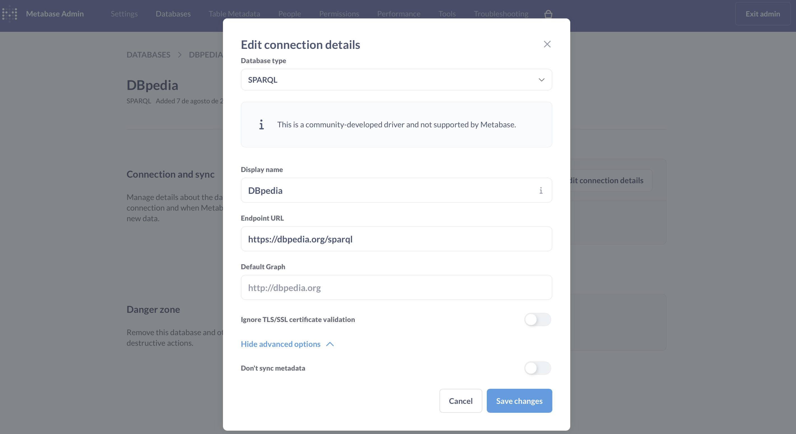
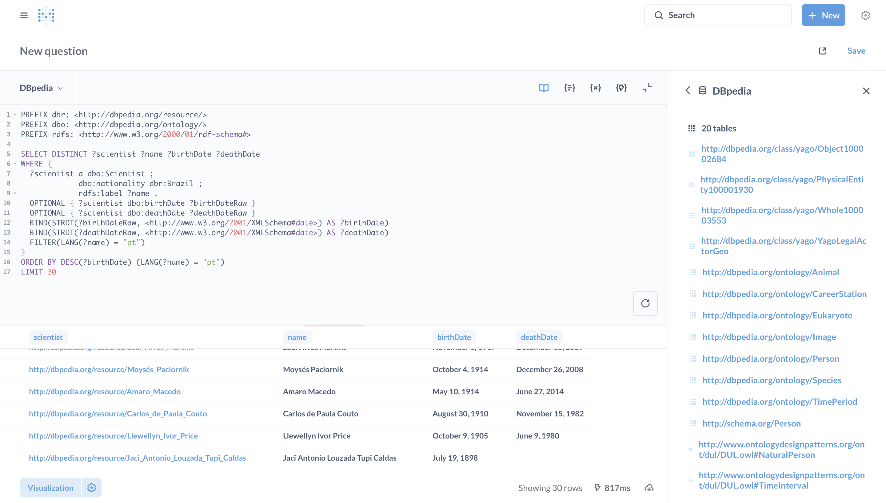
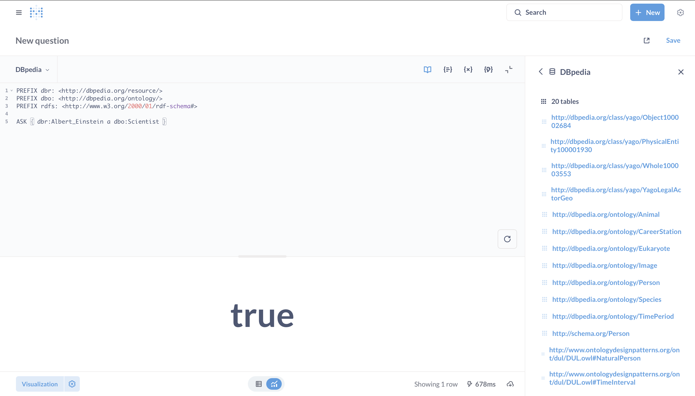
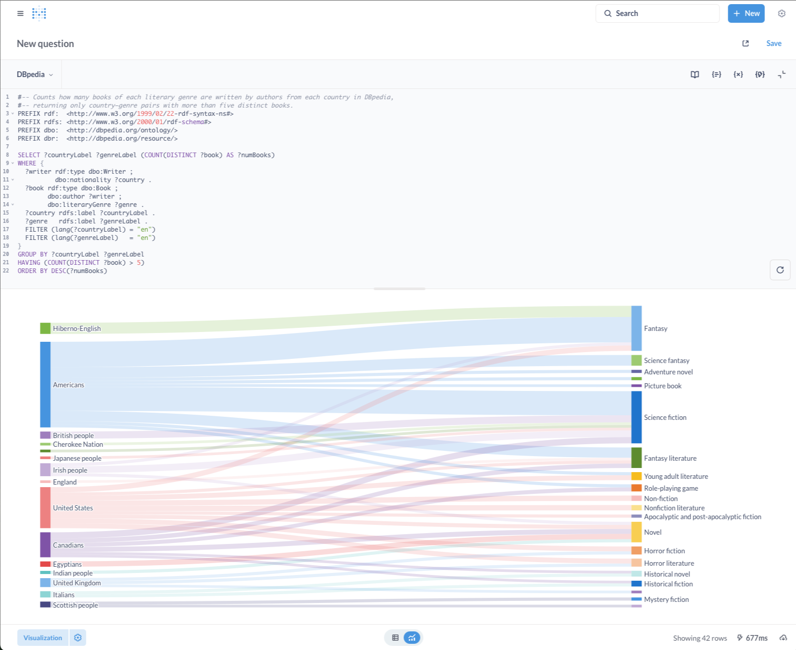

# Metabase SPARQL Driver


A driver for connecting Metabase to SPARQL endpoints for querying RDF data.

## :mag: Overview

This driver enables Metabase to connect to SPARQL endpoints using HTTP requests to query RDF data. It supports both secure and insecure connections with optional default graph specification.

This driver represents RDF classes as tables and properties as columns, allowing you to use Metabase's visual query builder to create SPARQL queries intuitively. Discovering the most frequent classes and properties can be computationally expensive on large datasets. You can disable this metadata synchronization feature in the driver's advanced configuration settings.

> [!TIP]
> If this repository is useful to you, please consider starring it ⭐.

## :handshake: Compatibility

| Driver Version | Metabase Version | Notes |
|:---------------|:-----------------|:------|
| **v0.1.0+**    | v0.56.3+         | Requires `describe-database*` (added in 0.56.3). |
| **v0.0.1 - v0.0.9** | < v0.56.3       | Uses legacy `describe-database`. |

## :zap: Quick Start

1. **Download** the latest driver from [releases page](https://github.com/jhisse/metabase-sparql-driver/releases)
2. **Copy** `sparql.metabase-driver.jar` to your Metabase `plugins/` directory
3. **Restart** Metabase
4. **Add database** → Select "SPARQL" → Enter endpoint URL

### :bulb: Try with DBpedia

- Endpoint URL: `https://dbpedia.org/sparql`
- Default Graph: `http://dbpedia.org`



#### Select Query Example

```sparql
PREFIX dbr: <http://dbpedia.org/resource/>
PREFIX dbo: <http://dbpedia.org/ontology/>
PREFIX rdfs: <http://www.w3.org/2000/01/rdf-schema#>

SELECT DISTINCT ?scientist ?name ?birthDate ?deathDate
WHERE {
  ?scientist a dbo:Scientist ;
             dbo:nationality dbr:Brazil ;
             rdfs:label ?name .
  OPTIONAL { ?scientist dbo:birthDate ?birthDateRaw }
  OPTIONAL { ?scientist dbo:deathDate ?deathDateRaw }
  BIND(STRDT(?birthDateRaw, <http://www.w3.org/2001/XMLSchema#date>) AS ?birthDate)
  BIND(STRDT(?deathDateRaw, <http://www.w3.org/2001/XMLSchema#date>) AS ?deathDate)
  FILTER(LANG(?name) = "pt")
}
ORDER BY DESC(?birthDate) (LANG(?name) = "pt")
LIMIT 30
```



#### Ask Query Example

```sparql
PREFIX dbr: <http://dbpedia.org/resource/>
PREFIX dbo: <http://dbpedia.org/ontology/>
PREFIX rdfs: <http://www.w3.org/2000/01/rdf-schema#>

ASK { dbr:Albert_Einstein a dbo:Scientist }
```



## :camera: Screenshots




## :arrows_counterclockwise: Automatic Type Conversion

The driver automatically converts XSD datatypes to Metabase types:

| XSD Datatype | Metabase Type | Examples |
|:-------------|:--------------|:---------|
| `xsd:integer`, `xsd:int`, `xsd:long`, `xsd:short`, `xsd:byte` | Integer | `42`, `-100` |
| `xsd:nonNegativeInteger`, `xsd:positiveInteger`, `xsd:unsignedInt` | Integer | `0`, `1`, `255` |
| `xsd:decimal`, `xsd:float`, `xsd:double` | Float | `3.14`, `2.718` |
| `xsd:boolean` | Boolean | `true`, `false` |
| `xsd:dateTime`, `xsd:gYear`, `xsd:gYearMonth` | DateTime | `2024-01-15T10:30:00Z` |
| `xsd:date`, `xsd:gMonthDay`, `xsd:gDay`, `xsd:gMonth` | Date | `2024-01-15` |
| `xsd:time` | Time | `10:30:00` |
| URIs | URL | `http://dbpedia.org/resource/Berlin` |
| Literals without datatype or with language tags | Text | `"Hello"@en` |

## :wrench: Configuration


| Field                                | Required | Description                                          | Example/Options               |
|:-------------------------------------|:--------:|:-----------------------------------------------------|:------------------------------|
| Endpoint URL                         |    ✅    | SPARQL endpoint URL                                  | `https://dbpedia.org/sparql`  |
| Default Graph                        |    ❌    | Default graph URI                                    | `http://dbpedia.org`          |
| Ignore TLS/SSL certificate validation|    ❌    | Skip SSL validation                                  | `false`                       |
| Metadata Sync Strategy (Advanced)    |    ❌    | How to discover tables/fields                        | `auto` / `none` / `explicit`  |
| Schema Configuration (Advanced)      |    ❌    | JSON schema (visible when strategy is `explicit`)    | See example below             |

**Metadata Sync Strategy options:**
- **`auto`** (default): Automatically discover tables and fields from the endpoint
  - **Class Discovery Limit**: Maximum number of RDF classes (tables) to discover (default: 100)
  - **Property Discovery Limit**: Maximum number of properties (fields) per class (default: 20)
  - **Discovery Sample Size**: Number of instances to sample when discovering properties (default: 10000)
- **`none`**: Skip metadata sync entirely (useful for very large datasets where discovery is slow)
- **`explicit`**: Use a manually defined JSON schema (see example below)

### Explicit Schema Configuration Example (DBpedia)

If you choose **Explicit** as the Metadata Sync Strategy, you can use the following JSON to define tables for DBpedia:

```json
{
  "tables": [
    {
      "name": "http://dbpedia.org/ontology/Person",
      "description": "Person",
      "fields": [
        "http://www.w3.org/2000/01/rdf-schema#label",
        "http://dbpedia.org/ontology/birthDate",
        "http://dbpedia.org/ontology/birthPlace",
        "http://xmlns.com/foaf/0.1/name"
      ]
    },
    {
      "name": "http://dbpedia.org/ontology/City",
      "description": "City",
      "fields": [
        "http://www.w3.org/2000/01/rdf-schema#label",
        "http://dbpedia.org/ontology/populationTotal",
        "http://dbpedia.org/ontology/country",
        "http://dbpedia.org/ontology/abstract"
      ]
    }
  ]
}
```

The schema is a JSON object with a `tables` key, which is an array of table objects. Each table object has:
- `name` (required): URI of the RDF class
- `description` (optional): Human-readable description of the table
- `fields` (required): Array of property URIs to include as columns

**JSON Schema for validation:**

```json
{
  "$schema": "http://json-schema.org/draft-07/schema#",
  "type": "object",
  "properties": {
    "tables": {
      "type": "array",
      "items": {
        "type": "object",
        "properties": {
          "name": {
            "type": "string",
            "description": "URI of the RDF class"
          },
          "description": {
            "type": "string",
            "description": "Human-readable description of the table"
          },
          "fields": {
            "type": "array",
            "items": {
              "type": "string",
              "description": "URI of the property"
            },
            "minItems": 1
          }
        },
        "required": ["name", "fields"]
      },
      "minItems": 1
    }
  },
  "required": ["tables"]
}
```

## :warning: Limitations and Known Issues

- **Aggregations**: Currently, the driver does not support aggregation functions in Query Builder (e.g., `COUNT`, `SUM`, `AVG`). Queries using "Summarize" in Metabase will likely fail or return incorrect results. Native queries using aggregation functions and any other SPARQL features are supported.
- **Performance**: Fetching large result sets or performing metadata discovery on extensive endpoints can be resource-intensive. To mitigate this, we implemented **Configurable Limits** (Class/Property Limit, Sample Size) and **Sync Strategies** (`explicit` or `none`) to control the scope of automatic discovery or skip it entirely.
- **Filter Support**: While **basic filtering works in Query Builder**, complex Metabase filter expressions or custom expressions might not be fully translated to SPARQL.
- **Authentication**: Currently, **no authentication** is supported. The driver does not provide fields for username/password.

## :building_construction: Build Locally From Source

### Prerequisites

- Git
- Clojure CLI tools
- Java Development Kit (JDK) 21

Run `make check-deps` to check if dependencies are installed.

### Building the Driver JAR

1. Clone this repository:

   ```bash
   git clone https://github.com/jhisse/metabase-sparql-driver.git
   cd metabase-sparql-driver
   ```

2. Initialize the Metabase submodule:

   ```bash
   make init-metabase
   ```

3. Build the driver:

   ```bash
   make build
   ```

4. The compiled driver will be available at:

   ```text
   target/sparql.metabase-driver.jar
   ```

## :whale: Build Only Driver with Docker

```bash
make docker-build-driver
```

## :whale: Build Metabase + Driver Docker Image

```bash
make docker-build
```

## :gear: Additional Make Commands

- `make build`: Build the SPARQL driver
- `make build-full`: Complete build with checks and initialization
- `make clean`: Remove build files
- `make init-metabase`: Initialize the Metabase submodule
- `make check-deps`: Check if dependencies are installed
- `make lint`: Lint code using clj-kondo
- `make format`: Format code using cljfmt
- `make splint`: Run splint static code analysis
- `make test`: Run tests
- `make coverage`: Run tests with coverage analysis
- `make docker-build`: Build docker image
- `make docker-run`: Run docker image
- `make docker-stop`: Stop docker image
- `make docker-clean`: Clean old container
- `make docker-build-driver`: Build driver with docker
- `make help`: Display this help

## Run with debug logs

To troubleshoot connection or query issues, run Metabase with debug logging:

```bash
java --add-opens java.base/java.nio=ALL-UNNAMED -Dlog4j.configurationFile=file:./log4j2.xml -jar metabase.jar
```

**Requirements:**
- Java 21 installed
- Place `metabase.jar` in the project root folder
- The `log4j2.xml` file is already configured for SPARQL driver debugging

**What you'll see:**
- SPARQL query execution details
- Connection attempts and errors
- Data type conversion processes
- Metadata sync operations

## :handshake: Contributing

Found a bug or want to contribute? Open an issue or submit a PR!

## :page_facing_up: License

This driver is licensed under the AGPLv3 license. See the [LICENSE](LICENSE) file for details.
